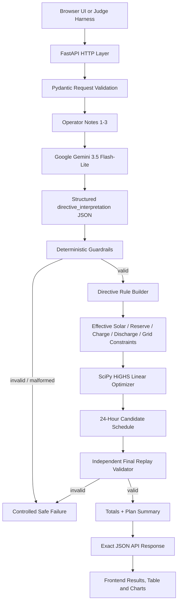

# GridWise

**BUP CSE Fest 2026 — Smart Campus Energy Optimization Challenge**  
**LLM-Assisted Operator Directive Interpretation**

GridWise is a single public HTTP service that receives a 24-hour campus energy scenario plus 1–3 natural-language operator notes, converts each note into a supported machine-checkable directive with an LLM, validates that interpretation deterministically, applies the valid directives to an optimization model, and returns a valid low-cost 24-hour schedule.

> The implementation follows the organizer's canonical split: **LLM for language understanding → deterministic guardrails → mathematical optimizer → independent final replay validation**.

## Submission Links

| Artifact | Link / Status |
|---|---|
| Live frontend | https://gridwise-bup.onrender.com/ |
| Health endpoint | https://gridwise-bup.onrender.com/health |
| Main API | https://gridwise-bup.onrender.com/optimize-energy |
| Swagger / OpenAPI | https://gridwise-bup.onrender.com/docs |
| GitHub repository | https://github.com/Taoshif1/GridWise |
| Docker fallback | `ghcr.io/taoshif1/gridwise:latest` via GitHub Actions workflow |
| 3-minute solution video | **Add final organizer-accessible MP4/link before submission** |

> Repository policy: keep the repository private during the event and make it public after the submission deadline for evaluation, following the participant guide.

---

## 1. Problem Summary

The campus energy system contains:

- grid electricity,
- rooftop solar,
- a battery energy storage system,
- 24 hourly demand values,
- 24 hourly solar-availability values,
- 24 hourly grid tariffs,
- 1–3 natural-language operator notes.

The service must:

1. interpret every operator note using a language-capable generative model,
2. map the note to exactly one supported directive or `no_op`,
3. deterministically validate the model output,
4. apply the validated directives to the scheduling problem,
5. satisfy all battery, solar, grid, and energy-balance rules,
6. return exactly 24 hourly plan entries,
7. minimize total grid electricity cost after correctness is satisfied.

Using an LLM only for summaries or documentation is not sufficient. In GridWise, the LLM output directly feeds the directive-validation and optimization path.

---

## 2. Full Architecture



### End-to-end data flow

```text
24-hour scenario + operator notes
              |
              v
        Pydantic schema
              |
              v
     Gemini 3.5 Flash-Lite
              |
              v
 directive_interpretation
              |
              v
 deterministic guardrails
              |
              v
 supported directive rules
              |
              v
 SciPy / HiGHS optimization
              |
              v
 24-hour candidate schedule
              |
              v
 independent deterministic replay
              |
              v
 exact API JSON + user frontend
```

### Why the architecture is split this way

The language model is responsible only for understanding human wording. The model output is treated as **untrusted structured data**. Deterministic code then validates the directive before the optimizer is allowed to use it.

This prevents the LLM from silently inventing unsupported constraints, changing base demand/tariff/battery parameters, or bypassing the organizer's machine-checkable rules.

---

## 3. Technology Stack

| Layer | Technology |
|---|---|
| API | FastAPI |
| Validation | Pydantic |
| LLM | Google Gemini 3.5 Flash-Lite |
| LLM transport | Google Gemini `generateContent` API via HTTPX |
| Optimization | SciPy `linprog` with HiGHS |
| Numerical arrays | NumPy |
| Frontend | HTML, CSS, Vanilla JavaScript |
| Production server | Uvicorn |
| Hosting | Render |
| Container fallback | Docker / GHCR |
| Tests | Pytest |

No frontend build system or Node.js runtime is required. FastAPI serves the static frontend directly.

---

## 4. Required API Contract

### Health endpoint

```http
GET /health
```

Expected response:

```json
{"status":"ok"}
```

### Main endpoint

```http
POST /optimize-energy
Content-Type: application/json
```

The request contains:

- `scenario_id`
- `operator_notes`: 1–3 non-empty strings
- `hours`: exactly 24 entries, unique hours 0–23
- `battery`: capacity, initial energy, base minimum, charge limit, discharge limit

### Request shape

```json
{
  "scenario_id": "GRID-101",
  "operator_notes": [
    "Solar output will drop to about 20% from 1 PM to 3 PM.",
    "Do not charge the battery between 2 PM and 4 PM.",
    "The cafeteria menu changes tomorrow."
  ],
  "hours": [
    {
      "hour": 0,
      "demand_kwh": 180,
      "solar_kwh": 0,
      "tariff_bdt_per_kwh": 7
    }
  ],
  "battery": {
    "capacity_kwh": 500,
    "initial_energy_kwh": 200,
    "minimum_energy_kwh": 50,
    "max_charge_kwh_per_hour": 100,
    "max_discharge_kwh_per_hour": 100
  }
}
```

> The real `hours` array must contain exactly 24 entries covering hours `0..23`. The abbreviated example above shows only one hourly object for readability.

### Successful response fields

```json
{
  "scenario_id": "GRID-101",
  "directive_interpretation": [],
  "hourly_plan": [],
  "total_grid_kwh": 0,
  "total_cost_bdt": 0,
  "peak_grid_kwh": 0,
  "plan_summary": "..."
}
```

Each `directive_interpretation` entry contains:

- `note_index`
- `applies`
- `directive_type`
- `structured_adjustment`
- `explanation`

Each `hourly_plan` entry contains:

- `hour`
- `grid_kwh`
- `solar_used_kwh`
- `battery_action`: `charge | discharge | idle`
- `battery_kwh`
- `battery_energy_after_kwh`

---

## 5. Supported Operator Directives

| Directive | Meaning | Required `structured_adjustment` |
|---|---|---|
| `solar_reduction` | Reduce usable solar for specific hours | `{"hours":[...], "factor": number}` |
| `minimum_battery_reserve` | Require a higher battery reserve | `{"hours":[...], "minimum_energy_kwh": number}` |
| `no_charge_window` | Charging unavailable | `{"hours":[...]}` |
| `no_discharge_window` | Discharging unavailable | `{"hours":[...]}` |
| `max_grid_window` | Cap grid import | `{"hours":[...], "max_grid_kwh": number}` |
| `no_op` | Note does not affect this schedule | `null` |

### Required semantics

- Every operator note produces exactly one interpretation entry.
- Entries are returned in `note_index` order.
- `no_op` uses:
  - `applies = false`
  - `directive_type = "no_op"`
  - `structured_adjustment = null`
- Every other directive uses `applies = true`.
- Hours are unique integers from 0 through 23 in ascending order.
- Time windows are start-inclusive and end-exclusive.
- Example: 1 PM to 3 PM → `[13, 14]`.
- For `solar_reduction`, `factor` means the usable fraction remaining.
- Example: 80% reduction → `factor = 0.2`.

---

## 6. LLM Interpretation

### Model

```text
Provider: Google Gemini
Model:    gemini-3.5-flash-lite
Role:     operator_notes → structured directive_interpretation
```

The model is called once for the operator-note interpretation stage. It is instructed to return only the supported directive schema.

The final plan summary is deterministic, so the system does not spend a second LLM call on cosmetic text.

### Multiple API keys

The backend supports multiple Gemini keys through:

```env
GEMINI_API_KEYS=key1,key2,key3
```

If a configured key is invalid, quota-limited, or unavailable in a retryable way, the backend can try another configured key. Keys are never returned to the frontend.

---

## 7. Deterministic Guardrails

The LLM output does **not** go directly to the optimizer.

The guardrail layer validates:

- exactly one interpretation per note,
- correct `note_index` mapping,
- supported directive type,
- `applies` semantics,
- exact `structured_adjustment` keys,
- unique sorted hours,
- hours within `0..23`,
- finite numeric values,
- solar factor within `0..1`,
- battery reserve not above battery capacity,
- non-negative grid caps,
- no unsupported modifications to demand, tariff, or battery parameters.

Malformed or unsupported model output is handled as a controlled failure rather than silently creating a new constraint.

---

## 8. Directive Application

Validated directives are converted to deterministic optimization rules.

### Solar reduction

```text
effective_solar[h] = base_solar[h] × factor
```

For overlapping solar reductions, the implementation keeps the most restrictive remaining usable fraction.

### Minimum reserve

```text
E_after[h] >= max(base_minimum, directive_minimum)
```

### No-charge window

```text
charge[h] = 0
```

### No-discharge window

```text
discharge[h] = 0
```

### Max-grid window

```text
grid[h] <= max_grid_kwh
```

---

## 9. Optimization Model

GridWise uses **SciPy HiGHS linear programming**.

For each hour, the implementation models:

- grid energy,
- solar energy used,
- signed battery flow,
- battery energy after the hour.

### Signed battery flow

```text
battery_flow > 0  => discharge
battery_flow < 0  => charge
battery_flow = 0  => idle
```

This avoids a degenerate model where charging and discharging could both be positive in the same hour.

### Energy balance

```text
grid + solar_used + battery_discharge
=
demand + battery_charge
```

Using the signed-flow form:

```text
grid + solar_used + battery_flow = demand
```

### Battery transition

```text
E_after = E_before - battery_flow
```

### Objective

```text
minimize Σ(grid_kwh[h] × tariff_bdt_per_kwh[h])
```

### End-of-day neutrality

```text
final battery energy = initial battery energy
```

The battery may shift energy between hours, but it cannot be used as a free one-time source by ending the day at a lower state of charge.

---

## 10. Independent Final Replay Validator

A successful optimizer status is not enough.

Before the response leaves the API, GridWise independently replays all 24 hours and verifies:

- exactly 24 hours, ordered `0..23`,
- non-negative output values,
- solar usage ≤ effective solar,
- battery energy ≥ active reserve,
- battery energy ≤ capacity,
- hourly charge/discharge rate limits,
- no-charge directives,
- no-discharge directives,
- max-grid directives,
- hourly energy balance,
- battery state transitions,
- action consistency,
- end-of-day battery neutrality,
- recalculated `total_grid_kwh`,
- recalculated `total_cost_bdt`,
- recalculated `peak_grid_kwh`.

The implementation uses a tolerance below the organizer's documented absolute tolerance of `0.01 kWh / BDT`.

---

## 11. Frontend

The required judging interface remains the JSON API. The frontend is an additional user-friendly view at:

**https://gridwise-bup.onrender.com/**

The UI allows a user to:

- load a ready test scenario,
- enter 1–3 operator notes,
- edit battery settings,
- edit all 24 hours,
- import scenario JSON,
- export scenario JSON,
- submit the optimization request,
- view the interpreted Gemini directives,
- view total grid usage,
- view total cost,
- view peak grid usage,
- inspect charts,
- inspect all 24 schedule rows,
- inspect/download the raw response JSON.

---

## 12. Environment Variables

Do not commit secret values.

```env
LLM_MODE=gemini

GEMINI_API_KEYS=comma_separated_keys
GEMINI_MODEL=gemini-3.5-flash-lite
GEMINI_BASE_URL=https://generativelanguage.googleapis.com/v1beta

LLM_TIMEOUT_SECONDS=10
LLM_MAX_RETRIES=1
GEMINI_MAX_KEY_ATTEMPTS=4

PORT=1337
```

### Secret-handling policy

- `.env` is not committed.
- Gemini keys stay server-side.
- Keys are not exposed in frontend JavaScript.
- Keys are not baked into Docker images.
- API responses do not include keys.
- Application logs should not print raw keys.
- Hosting secrets are supplied through the platform environment.

---

## 13. Live Deployment

Production hosting:

```text
Platform: Render
Region:   Singapore
URL:      https://gridwise-bup.onrender.com
```

Render start command:

```bash
uvicorn app.main:app --host 0.0.0.0 --port $PORT
```

External readiness check:

```bash
curl https://gridwise-bup.onrender.com/health
```

Expected:

```json
{"status":"ok"}
```

UI configuration check:

```bash
curl https://gridwise-bup.onrender.com/ui-config
```

---

## 14. Clean Local Quickstart — Python

### Requirements

- Python 3.10+
- Git
- Gemini API key

Clone:

```bash
git clone https://github.com/Taoshif1/GridWise.git
cd GridWise
```

Restore the source payload and install dependencies:

```bash
bash render_build.sh
```

Create a local environment file:

```bash
cp .env.example .env
```

Set at minimum:

```env
LLM_MODE=gemini
GEMINI_API_KEYS=YOUR_GEMINI_KEY
GEMINI_MODEL=gemini-3.5-flash-lite
PORT=1337
```

Run:

```bash
uvicorn app.main:app --host 0.0.0.0 --port 1337
```

Verify:

```bash
curl http://127.0.0.1:1337/health
```

Expected:

```json
{"status":"ok"}
```

---

## 15. Local Quickstart — Docker

After cloning and restoring the source:

```bash
git clone https://github.com/Taoshif1/GridWise.git
cd GridWise
bash render_build.sh
```

Build:

```bash
docker build -t gridwise-bup:latest .
```

Run:

```bash
docker run --rm   --env-file .env   -p 1337:1337   gridwise-bup:latest
```

Verify:

```bash
curl http://127.0.0.1:1337/health
```

The application binds to `0.0.0.0` inside the container.

---

## 16. Docker Fallback via GHCR

This repository includes:

```text
.github/workflows/publish-ghcr.yml
```

The workflow restores the source payload, builds the Docker image, and publishes:

```text
ghcr.io/taoshif1/gridwise:latest
ghcr.io/taoshif1/gridwise:<commit-sha>
```

Judge fallback command after the GHCR package is made pullable:

```bash
docker pull ghcr.io/taoshif1/gridwise:latest

docker run --rm   -p 1337:1337   -e LLM_MODE=gemini   -e GEMINI_API_KEYS="YOUR_GEMINI_KEY"   -e GEMINI_MODEL=gemini-3.5-flash-lite   -e GEMINI_BASE_URL=https://generativelanguage.googleapis.com/v1beta   ghcr.io/taoshif1/gridwise:latest
```

Then:

```bash
curl http://127.0.0.1:1337/health
```

> Before final submission, verify the image is actually published and configure the GHCR package visibility so organizers can pull it without team intervention.

---

## 17. Test the Main API

A local smoke-test payload is restored as:

```text
sample_request.json
```

Run against the live deployment:

```bash
curl -X POST "https://gridwise-bup.onrender.com/optimize-energy"   -H "Content-Type: application/json"   --data-binary @sample_request.json
```

Or locally:

```bash
curl -X POST "http://127.0.0.1:1337/optimize-energy"   -H "Content-Type: application/json"   --data-binary @sample_request.json
```

### Automated tests

Install development dependencies:

```bash
pip install -r requirements-dev.txt
```

Run:

```bash
pytest -q
```

The test suite covers:

- health endpoint,
- malformed-request handling,
- guardrail behavior,
- optimizer validity,
- reserve constraints,
- grid-cap constraints,
- 24-hour final replay.

### Organizer Public Sample Cases

The two organizer PDFs reference a separate **Public Sample Cases JSON**. That JSON was not among the organizer files available when this README was updated.

Therefore:

- `sample_request.json` is a project smoke-test scenario,
- it must not be represented as the organizer's Public Sample Cases file,
- if the official Public Sample Cases JSON is supplied, it should be added to the repository and executed against `POST /optimize-energy` before final submission.

---

## 18. Error Handling and Reliability

GridWise handles:

- malformed request bodies,
- invalid request schemas,
- malformed LLM output,
- unsupported directive output,
- infeasible optimization results,
- final replay failures,
- Gemini provider/network errors,
- invalid or quota-limited configured API keys.

The application returns controlled failures rather than exposing stack traces or inventing unsupported constraints.

Organizer operational targets documented in the participant guide:

- `GET /health` should become ready within 60 seconds,
- `POST /optimize-energy` must complete within 30 seconds,
- p95 ≤ 5 seconds receives full latency credit,
- valid repeated requests should remain stable.

---

## 19. Performance and Evaluation Alignment

The organizer evaluates the complete pipeline, not only cost.

| Category | Points |
|---|---:|
| LLM Directive Interpretation | 25 |
| Directive Application & Constraint Correctness | 25 |
| Optimization Quality | 10 |
| API Contract & Schema | 10 |
| Performance & Reliability | 10 |
| Deployment & Docker Fallback | 10 |
| Documentation & Local Reproducibility | 10 |
| **Total** | **100** |

The 3-minute architecture/solution video carries no base points and is used as a tie-break when total scores are equal.

---

## 20. Repository Structure

After `render_build.sh` restores the project:

```text
GridWise/
├── app/
│   ├── __init__.py
│   ├── config.py
│   ├── guardrails.py
│   ├── llm.py
│   ├── main.py
│   ├── optimizer.py
│   ├── rules.py
│   ├── schemas.py
│   └── validator.py
├── frontend/
│   ├── app.js
│   ├── index.html
│   └── styles.css
├── scripts/
│   └── smoke_test.py
├── tests/
│   ├── test_api.py
│   ├── test_guardrails.py
│   └── test_optimizer.py
├── Dockerfile
├── docker-compose.yml
├── requirements.txt
├── requirements-dev.txt
├── sample_request.json
├── .env.example
└── README.md
```

---

## 21. Main Modules

### `app/main.py`

FastAPI routes and complete request pipeline.

### `app/schemas.py`

Exact request/response validation models.

### `app/llm.py`

Gemini integration, structured-output prompt, model-response parsing, and multi-key fallback.

### `app/guardrails.py`

Deterministic validation of LLM-produced directives.

### `app/rules.py`

Converts validated directives into effective deterministic constraints.

### `app/optimizer.py`

SciPy / HiGHS linear optimization.

### `app/validator.py`

Independent final replay of all 24 hours and aggregate totals.

### `frontend/`

User-facing interface. It is not part of the required machine judging contract.

---

## 22. Dependencies and Credits

External libraries/services used:

- FastAPI
- Uvicorn
- Pydantic
- HTTPX
- NumPy
- SciPy / HiGHS
- python-dotenv
- Google Gemini API
- Render
- Docker
- GitHub Actions / GHCR

AI coding assistance and public libraries/frameworks are permitted by the participant guide; the architecture, validation path, optimization integration, and final submission are maintained in this repository.

---

## 23. Known Limitations

- The final judging path depends on external Gemini API availability, quota, and rate limits.
- Free hosting may have cold-start behavior, which can affect first-request latency.
- The official Public Sample Cases JSON was not available in the organizer files used for this README update.
- GHCR package visibility must be verified before submission so organizers can pull the Docker fallback without team intervention.
- The final 3-minute video URL must be added before submission.

---

## 24. Final Submission Checklist

Before submitting, verify all of the following:

- [x] Public `GET /health` endpoint exists.
- [x] Public `POST /optimize-energy` endpoint exists.
- [x] API uses the exact required endpoint names.
- [x] 1–3 operator notes are accepted.
- [x] Exactly one `directive_interpretation` entry is produced per note.
- [x] `no_op` uses `applies=false` and `structured_adjustment=null`.
- [x] Non-`no_op` directives use `applies=true`.
- [x] LLM output passes deterministic guardrails before optimization.
- [x] Directive hours are validated as unique ascending integers `0..23`.
- [x] Supported numeric ranges are validated.
- [x] Energy balance is replayed.
- [x] Effective solar is replayed.
- [x] Battery transitions/bounds/rate limits are replayed.
- [x] Grid caps are replayed.
- [x] End-of-day battery neutrality is replayed.
- [x] `total_grid_kwh`, `total_cost_bdt`, and `peak_grid_kwh` are independently recalculated.
- [x] README documents model/provider, LLM role, guardrails, optimizer, dependencies, env names, run commands, health test, API test, Docker path, limitations, and secret handling.
- [x] Live Render endpoint is deployed.
- [x] No Gemini secret values are intentionally documented in this README.
- [ ] Run the official Public Sample Cases JSON when supplied.
- [ ] Confirm GHCR fallback image is published and anonymously pullable for judges.
- [ ] Add exact Docker image tag/digest to the final submission form if required.
- [ ] Add the organizer-accessible 3-minute solution video link.
- [ ] After the submission deadline, make the repository public for evaluation as required by the guide.
- [ ] Re-test the live endpoint from an external network immediately before submission.

---

## 25. 3-Minute Video Coverage

The final video should stay within 3:00 and cover:

1. the smart-campus scheduling problem,
2. the full architecture,
3. Gemini interpreting operator notes,
4. deterministic guardrails,
5. directive application,
6. SciPy / HiGHS optimization,
7. final 24-hour replay,
8. live `/health` and `/optimize-energy` testing,
9. Docker / reproducibility path.

---

## 26. Judge Quick Reference

```text
Live base URL:
https://gridwise-bup.onrender.com

Health:
GET https://gridwise-bup.onrender.com/health

Optimize:
POST https://gridwise-bup.onrender.com/optimize-energy

Swagger:
https://gridwise-bup.onrender.com/docs

Frontend:
https://gridwise-bup.onrender.com/
```

### Core rule

```text
Understand operator note
        ↓
Validate structured directive
        ↓
Apply directive to optimization
        ↓
Produce valid 24-hour schedule
        ↓
Replay and verify schedule
        ↓
Minimize grid cost
```

A cheaper schedule is not considered correct if it misunderstands a note, ignores an applicable directive, or violates the normal GridWise energy rules.
